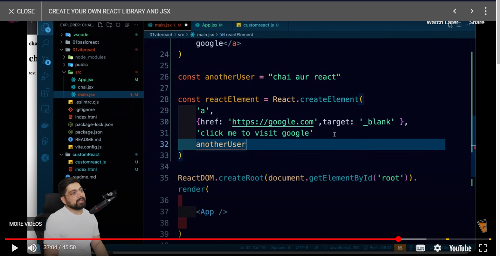

## Learning from the Project

- We learned how elements are created in the **React**, behind the scene
- Every element has 3 properties
  - type
  - props
  - children
- Look at the code, We have designed a custom function which render the element
- but this function is custom, how react does this?
- All this stuff is done by bundler i.e bable
- Now react does this, using its inbuild method `React.createElement`
- 
- `createElement` contain 4 props
  - Type of Tag
  - props
  - Children
  - Variable

## TAg & App() are same

```javascript
<App />;
App();
// Both are same
```

- `<App />` is a method, because behind the scene we are running `React.createElement`, and it is excepting different props

## Evaluted Expression

```javascript
const App = () => {
  let name = "Ankush";

  if (name === "Ankush") {
    return name;
  } else {
    name = "tanvi";
  }

  return <div>{name} /* This is evaluted expression*/</div>;
};
```

- return ke ander hmesha evaluted expression aaegye
  - mtlb end Result aaegya, jo bhi logic hoga, vo uper hoga
